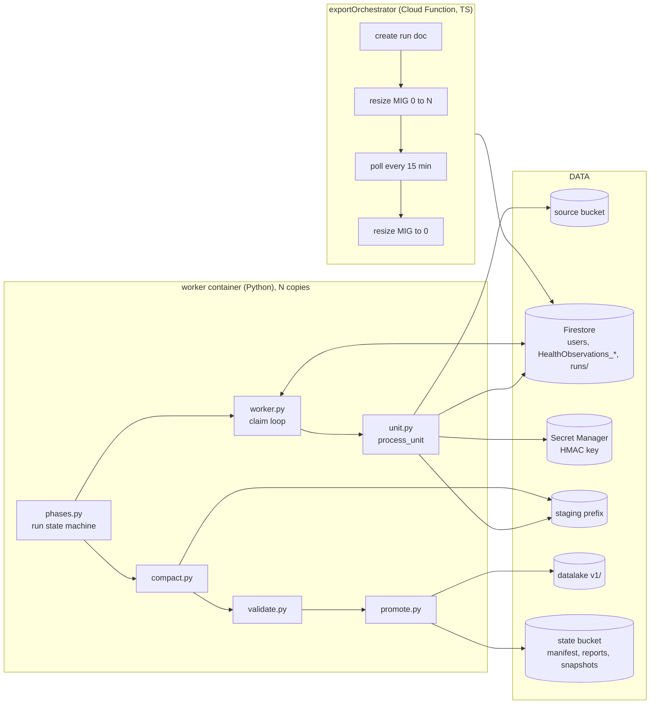

<!--
This source file is part of the My Heart Counts project

SPDX-FileCopyrightText: 2026 Stanford University and the project authors (see CONTRIBUTORS.md)
SPDX-License-Identifier: MIT
-->

# Export Pipeline: Implementation Sketch

Companion to [export-pipeline-overview.md](export-pipeline-overview.md), which says *what* the pipeline does and why. This document says *how* the code is shaped so that implementation can start without re-deciding structure. Nothing here is built yet.

## Where the code lives

```text
export/                          Python package, one container image, one CLI
  pyproject.toml                 python 3.12, pyarrow, duckdb, zstandard, orjson, google-cloud-{storage,firestore,secret-manager}, pydantic
  Dockerfile
  mhc_export/
    cli.py                       entry point: plan | work | compact | validate | promote | run-local | dry-run
    config.py                    Settings from env: project ids, bucket names, key secret, run id
    io/
      blobstore.py               one interface over gs:// and file:// (list, read, write-if-absent, copy)
      codec.py                   sniff zstd | zlib | plain, decompress, parse JSON array
    sources/
      bucket.py                  list source objects in old and new layout, group by (uid, sampleType)
      firestore.py               user docs (eligibility, historical flag), HealthObservations_* per user
    identity/
      participants.py            uid -> participant_id, create on first sight, Firestore-backed
      grove_ids.py               HMAC source-record / source-output per the Grove exchange protocol
    grove/
      upgrade.py                 old MHC FHIR shape -> Grove HealthKit profile, in memory
    transform/
      specs.py                   load schemas/*.json into TypeSpec (pyarrow schema + FHIR path allowlist)
      project.py                 Grove Observation -> Row: allowlist, casts, unit conversion, time rules
      tombstones.py              deletion CSVs + retraction bundles -> set[sample_id]
      dedup.py                   per-unit precedence rules
      writer.py                  rows -> parquet part with deterministic name
    run/
      models.py                  Run, Unit, SourceObject, Lease, UnitResult, RunReport (pydantic)
      manifest.py                build + read runs/{run_id}/manifest.jsonl
      leases.py                  claim / renew / complete / fail, Firestore transactions
      worker.py                  loop: claim unit -> process_unit -> complete
      unit.py                    process_unit(): the whole per-unit pipeline
      phases.py                  run-level state machine: planning -> processing -> compacting -> validating -> promoting -> done
      compact.py                 duckdb per (type, year, month) -> ~500 MB files
      validate.py                schema, counts vs manifest, null profile, PHI scan
      promote.py                 copy compacted -> v1/, snapshot manifest, watermark, report
  schemas/
    HKQuantityTypeIdentifierHeartRate.json
    HKQuantityTypeIdentifierStepCount.json
    ...                          one file per exported sample type
  tests/
    fixtures/<sampleType>/input/*.json.zstd, *.csv.zstd, firestore.json
    fixtures/<sampleType>/expected/*.parquet
    test_codec.py test_upgrade.py test_project.py test_dedup.py test_unit.py test_e2e_local.py

functions/src/functions/exportOrchestrator.ts   thin: create run doc, resize instance group, poll, scale to zero
```

One container image serves every role. Which role a process plays is a CLI argument, and on a VM it is read from instance metadata. The TypeScript orchestrator contains no pipeline logic; everything that touches data is Python so that the local run and the production run execute the same code.

## Component diagram



## Run state machine

The run document `runs/{run_id}` in Firestore carries `phase`. Workers advance phases by claiming a phase lease exactly like a unit lease, so no worker is special and the orchestrator never runs pipeline code.

| Phase | Who | Lease | What |
|---|---|---|---|
| `planning` | first worker to claim it | `runs/{run_id}/phases/plan` | discover + build manifest + create unit docs; others wait |
| `processing` | all workers | `runs/{run_id}/units/{unit_id}` | process units until none pending |
| `compacting` | one worker per (type, year, month) | `runs/{run_id}/compactions/{key}` | duckdb merge |
| `validating` | one worker | `runs/{run_id}/phases/validate` | checks, writes verdict |
| `promoting` | one worker | `runs/{run_id}/phases/promote` | copy, snapshot, watermark, report |
| `done` / `failed` | | | orchestrator scales to zero |

A phase moves forward only when every lease of the previous phase is `done`. Any crash leaves an expired lease that another worker picks up. Re-running a `done` run is a no-op at every phase because every output name is deterministic and every write is write-if-absent.

## Models

```python
class SourceObject(BaseModel):
    uri: str                     # gs://.../users/{uid}/historicalHealthSamples/x.json.zstd or new layout
    generation: int              # pinned so a rewrite between plan and process is detected
    size: int
    layout: Literal["legacy", "v1"]
    upload_kind: Literal["historical", "live", "deletions"]
    data_version: str            # "pre-grove" when no metadata

class Unit(BaseModel):
    unit_id: str                 # f"{uid}:{sample_type}"
    uid: str
    sample_type: str
    objects: list[SourceObject]  # samples and deletions for this user+type
    firestore_collection: str | None
    expected_bytes: int

class Run(BaseModel):
    run_id: str                  # "r2026-10"
    batch_start: datetime        # previous watermark
    batch_end: datetime          # first day of current month 00:00 UTC
    phase: Phase
    grove_package_version: str
    key_id: str; key_epoch: int

class Lease(BaseModel):         # Firestore doc, one per unit / compaction / phase
    state: Literal["pending", "leased", "done", "failed"]
    owner: str | None            # instance name
    lease_expires_at: datetime | None
    heartbeat_at: datetime | None
    attempts: int
    result: UnitResult | None
    error: str | None

class UnitResult(BaseModel):
    rows_in: int; rows_out: int
    dropped_non_final: int; dropped_unparseable: int; skipped_clinical: int
    dedup_removed: int; tombstoned: int; tuple_collisions: int
    parts: list[str]             # staging URIs written
    seconds: float
```

`manifest.jsonl` is the list of `Unit` objects, written once by the planner and read by everyone. Unit docs in Firestore hold only the `Lease`; the heavy content stays in the manifest.

## process_unit, end to end

```python
def process_unit(unit: Unit, deps: Deps) -> UnitResult:
    spec = deps.specs[unit.sample_type]                     # TypeSpec from schemas/
    participant_id = deps.participants.get_or_create(unit.uid)
    rows = RowBuffer(spec.arrow_schema)
    tombstones: set[str] = set()

    for obj in unit.objects:
        blob = deps.blobstore.read(obj.uri, generation=obj.generation)
        if obj.upload_kind == "deletions":
            tombstones |= tombstones_from_csv(decode(blob), deps.grove_ids)
            continue
        for resource in decode(blob):                         # list[dict]
            if is_clinical_record(resource): counters.skipped_clinical += 1; continue
            obs = upgrade_to_grove(resource, obj, deps.grove_ids)   # no-op for v1 objects
            if obs is None: counters.dropped_unparseable += 1; continue
            if obs.status != "final": counters.dropped_non_final += 1; continue
            rows.append(project(obs, spec, participant_id, upload_kind=obj.upload_kind, from_archive=True))

    for resource in deps.firestore.observations(unit.uid, unit.sample_type):
        ...same, from_archive=False...
    tombstones |= deps.firestore.retractions(unit.uid, unit.sample_type)

    table = rows.to_table()
    table = dedup(table)                                      # writer_version desc, issued desc, firestore over archive
    table = table.filter(~pc.is_in(table["sample_id"], tombstones))
    table = table.sort_by([("effective_start", "ascending")])

    parts = []
    for (year, month), slice in split_by_month(table):        # a unit may span months
        uri = f"{deps.staging}/{unit.sample_type}/year={year}/month={month:02d}/{unit.unit_id}.parquet"
        deps.blobstore.write(uri, to_parquet(slice), overwrite=True)   # same unit -> same name
        parts.append(uri)
    return UnitResult(...)
```

Everything above `table = rows.to_table()` streams; one object is in memory at a time. The unit's rows fit in memory by construction of the unit, and if a unit ever does not, the planner splits it by source object range into `unit_id#0`, `unit_id#1` with the dedup moved into compaction for that type-month. That is the one escape hatch and it is not built until needed.

## The pure core

Three functions carry all the domain logic and have no I/O. They are what the golden tests cover.

```python
def decode(blob: bytes) -> list[dict]
    # magic bytes: 28 B5 2F FD zstd | 78 xx zlib | 5B '[' plain; then orjson.loads; must be a JSON array

def upgrade_to_grove(resource: dict, src: SourceObject, ids: GroveIds) -> GroveObservation | None
    # pre-grove: identifier[0].value is the HK UUID -> ids.source_record(uid, uuid), ids.source_output(...)
    #            bdh sourceDevice/* -> recording device fields; bdh sourceRevision/{version,productType,OSVersion} kept,
    #            sourceRevision/source/{name,bundleIdentifier} dropped; sampleUploadTimeZone -> offset only if upload_kind == live
    #            study-enrollment -> study_revision; mhcAppRevision -> app_version/app_build
    # v1 (already Grove): parse typed identifiers, pass through

def project(obs: GroveObservation, spec: TypeSpec, participant_id: str, *, upload_kind, from_archive) -> Row
    # allowlist by spec.paths; value -> float64 or fail; unit -> spec.unit via UCUM factor table or fail;
    # effective -> UTC ms + utc_offset_min + timezone (NULL for historical unless HK tz metadata present)
```

`GroveObservation` is a small typed view over the resource dict, not a full FHIR model; the pipeline reads a few dozen paths and nothing else.

## Schema files

One JSON file per sample type is the single source of truth for the Parquet schema, the BigQuery DDL, and the projection allowlist.

```json
{
  "sample_type": "HKQuantityTypeIdentifierHeartRate",
  "kind": "quantity",
  "unit": "/min",
  "accepted_units": {"/min": 1.0},
  "columns": "common",
  "extra_columns": [
    {"name": "motion_context", "type": "STRING",
     "path": "extension[url=.../metadata].extension[url=.../HKMetadataKeyHeartRateMotionContext].valueCoding.code"}
  ]
}
```

`specs.py` turns this into a pyarrow schema and a list of extractor functions. A column exists only if it is in the file. Adding a column is a new file version and is additive by the rule in the overview.

## Blob store abstraction

```python
class BlobStore(Protocol):
    def list(self, prefix: str) -> Iterator[ObjectInfo]
    def read(self, uri: str, generation: int | None = None) -> bytes
    def write(self, uri: str, data: bytes, *, overwrite: bool) -> None   # overwrite=False -> if-generation-match 0
    def copy(self, src: str, dst: str, *, overwrite: bool) -> None
```

Two implementations: `GcsBlobStore` and `LocalBlobStore` over a directory. Leases get the same treatment: `FirestoreLeases` and `MemoryLeases`. That is what makes `run-local` possible.

## CLI

```text
mhc-export plan      --run-id r2026-10 --batch-end 2026-10-01T00:00Z        [--dry-run]
mhc-export work      --run-id r2026-10 [--max-units N]                       # the VM entry point; loops phases
mhc-export compact   --run-id r2026-10 [--key HKQuantityTypeIdentifierHeartRate/2024/03]
mhc-export validate  --run-id r2026-10
mhc-export promote   --run-id r2026-10
mhc-export run-local --source-dir tests/fixtures --out ./out --run-id test   # all phases, local store, memory leases
mhc-export dry-run   --batch-end 2026-10-01T00:00Z                           # plan + validate inputs against prod, no writes
```

`work` is the only command a VM runs; it drives the phase machine until the run is done or no lease is claimable. The separate commands exist for operators and for tests.

## Compaction, validation, promotion

```sql
-- compact.py, per (type, year, month)
COPY (
  SELECT * FROM read_parquet('staging/r2026-10/<type>/year=2024/month=03/*.parquet')
  ORDER BY participant_id, effective_start
) TO 'staging/r2026-10/compacted/<type>/year=2024/month=03/'
  (FORMAT PARQUET, COMPRESSION ZSTD, FILE_SIZE_BYTES 500000000, ROW_GROUP_SIZE 1000000);
```

Validation reads the compacted files only: schema equals spec, `sum(rows_out)` over unit results equals row count per type, null rate per column within the spec's declared bounds, a regex PHI scan over all STRING columns on a 1 percent sample, and the tuple-collision count from the unit results reported but not gating.

Promotion copies `compacted/<type>/year=/month=/part-*.parquet` to `v1/<type>/year=/month=/part-r2026-10-<n>.parquet` with overwrite off, writes `runs/r2026-10/snapshot.jsonl` listing every file under `v1/` after the copy, advances the watermark in one Firestore transaction, and writes `runs/r2026-10/report.json`. If the researchers want citable datasets, the snapshot file is the citation.

## Orchestrator

```ts
// functions/src/functions/exportOrchestrator.ts, sketch
export const exportOrchestrator = onSchedule({ schedule: "0 2 20 * *", timeZone: "UTC" }, async () => {
  const runId = currentRunId();                     // "r2026-10"
  await ensureRunDoc(runId, batchEndForNow());      // idempotent
  await resizeInstanceGroup(N_FOR(runId));          // compute API
});
export const exportWatchdog = onSchedule({ schedule: "every 15 minutes" }, async () => {
  const run = await activeRun(); if (!run) return;
  if (run.phase === "done" || run.phase === "failed") return resizeInstanceGroup(0);
  if (await noHeartbeatSince(run, LEASE_TTL * 2)) await alert("export run stuck", run);
});
```

## Testing

- **Golden files:** for each schema file, a fixture directory with real-shaped inputs in both layouts, a deletion CSV, and the expected Parquet. `test_unit.py` runs `process_unit` against `LocalBlobStore` and compares tables exactly.
- **Property tests:** `dedup` is idempotent and order-independent; `project` never emits a non-NULL string in a numeric column; `decode` round-trips through all three codecs.
- **End to end:** `run-local` over the fixture tree produces a `v1/` directory and a report; the test asserts on both and then runs it a second time and asserts nothing changed.
- **Dry run against production:** `dry-run` in CI with the read-only service account, weekly, so layout drift in uploads is caught before the 20th.

## What is deliberately not in the sketch

No Spark, no Beam, no queue service, no custom VM image, no per-participant output folders, no in-pipeline schema evolution. Each of these has a place in the overview's escalation notes and none is needed for the first production run.
